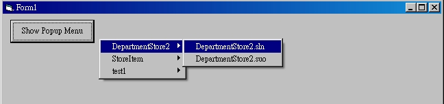



## Create runtime popup menu

### Description

Create runtime popup menu with sub menu items
 
### More Info
 

             |
---                |---
**Submitted On**   |2010-03-18 21:40:02
**By**             |[Red Corn](https://github.com/Planet-Source-Code/PSCIndex/blob/master/ByAuthor/red-corn.md)
**Level**          |Beginner
**User Rating**    |4.0 (8 globes from 2 users)
**Compatibility**  |VB 6\.0
**Category**       |[Custom Controls/ Forms/  Menus](https://github.com/Planet-Source-Code/PSCIndex/blob/master/ByCategory/custom-controls-forms-menus__1-4.md)
**World**          |[Visual Basic](https://github.com/Planet-Source-Code/PSCIndex/blob/master/ByWorld/visual-basic.md)
**Archive File**   |[Create\_run2177363182010\.zip](https://github.com/Planet-Source-Code/red-corn-create-runtime-popup-menu__1-72985/archive/master.zip)

